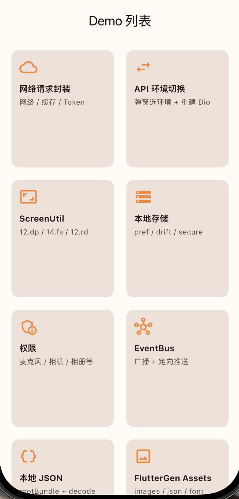
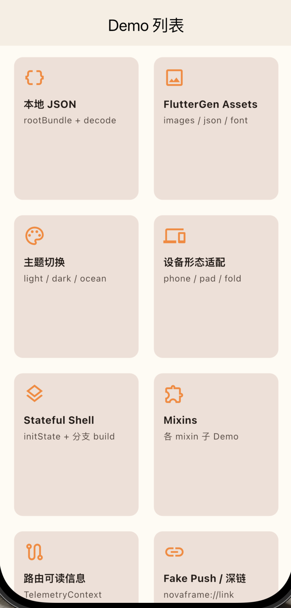
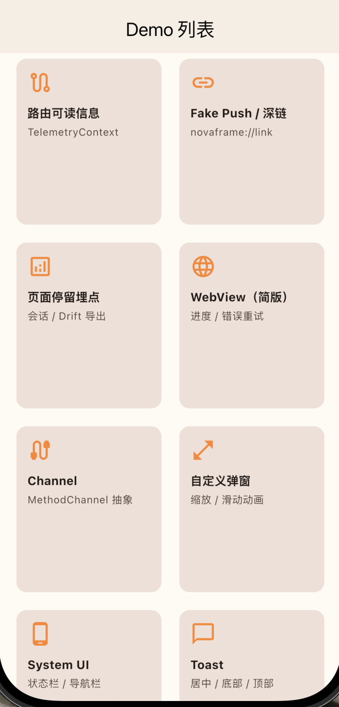
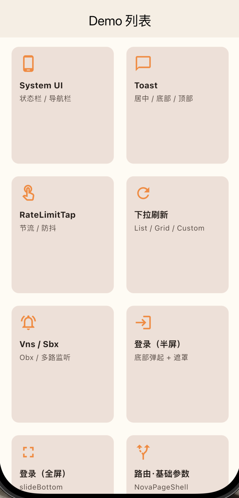
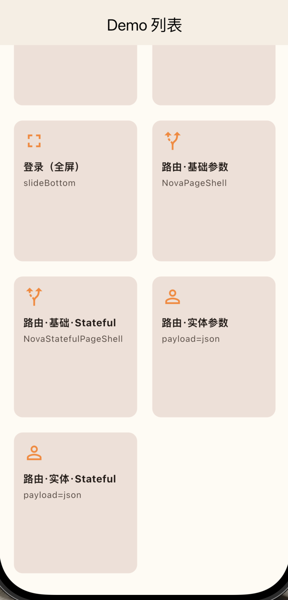

# nova_frame

Flutter 基建与示例工程：路由、网络、存储、主题、埋点、状态封装等，可作为新业务 App 的起始模板。

辅助工具：**Cursor**


<table>
  <tr>
    <td align="center"></td>
    <td align="center"></td>
    <td align="center"></td>
  </tr>
  <tr>
    <td align="center"></td>
    <td align="center"></td>
  </tr>
</table>


## 环境要求
- Flutter SDK `^3.41.9`


## 运行前

```bash
flutter pub get
dart run build_runner build --delete-conflicting-outputs
```


## 架构说明

```
┌─────────────────────────────────────────────────────────┐
│  app（主题 / 文案资源 / 设备形态 / System UI / 页面 Mixin）  │
├─────────────────────────────────────────────────────────┤
│  core（基建）                                            │
│    · navigation — 路由 / 深链                            │
│    · services   — 网络 / 存储 / 原生 Channel              │
│    · shared     — 通用 UI / 工具 / EventBus / WebView    │
│    · foundation — 日志 / Vns·Obx 状态封装                 │
│    · telemetry  — 页面停留埋点                            │
├─────────────────────────────────────────────────────────┤
│  features（业务模块，按 feature 拆分；新业务代码放此层）     	│
└─────────────────────────────────────────────────────────┘
```


## 目录结构

```
lib
├── main.dart                                         # 默认启动入口：初始化环境、主题、路由
├── app                                               # 应用层：主题、资源、设备形态、页面 Mixin
│   ├── device
│   │   └── device_form_factor.dart                   # 设备形态（手机/平板等）判断
│   ├── page
│   │   └── mixins
│   │       ├── app_lifecycle_mixin.dart              # 应用前后台生命周期
│   │       ├── keyboard_visibility_mixin.dart        # 键盘显/隐监听
│   │       └── route_aware_mixin.dart                # RouteAware 封装
│   ├── res
│   │   ├── app_colors.dart                           # 定义哪些UI颜色，需要主题
│   │   └── app_strings.dart                          # 项目常用文案统一管理
│   ├── system_ui
│   │   └── system_ui_styles.dart                     # 状态栏 / 导航栏样式
│   └── theme
│       ├── app_theme.dart                            # ThemeData 构建
│       ├── app_theme_type.dart                       # 主题类型枚举
│       ├── theme_app_colors.dart                     # 定义哪些UI颜色，需要主题
│       ├── theme_controller.dart                     # 主题切换控制器
│       └── theme_scope.dart                          # 主题 InheritedWidget
├── core
│   ├── foundation
│   │   ├── logger
│   │   │   └── nova_logger.dart                      # Debug 日志（仅 kDebugMode）
│   │   └── reactive
│   │       ├── value_state.dart                      # Vns / Obx（ValueNotifier 封装）
│   │       ├── stream_state.dart                     # Sns / Sbx（Stream 封装）
│   │       ├── multi_listen.dart                     # 多 Vns 合并监听
│   │       ├── page_state.dart                       # PageVns / PageObx 页面加载态
│   │       ├── page_load_state.dart                  # loading / success / failure / silentRefresh
│   │       ├── page_load_phase.dart                  # 加载阶段枚举
│   │       └── provided_consumer.dart                # Provider 消费封装
│   ├── navigation
│   │   ├── nova_router.dart                          # AutoRoute 路由表（含深链覆盖）
│   │   ├── nova_router.gr.dart                       # 路由代码生成（build_runner）
│   │   ├── nova_route_observer.dart                  # 路由观察者（埋点、调试等）
│   │   ├── nova_navigator_context.dart               # 全局 NavigatorKey / BuildContext
│   │   ├── nova_route_labels.dart                    # 路由 → 页面中文描述（埋点用）
│   │   ├── annotation
│   │   │   └── nova_route.dart                       # @NovaRoute 注解
│   │   ├── link
│   │   │   ├── nova_app_links.dart                   # 深链 / Universal Link 监听与跳转
│   │   │   └── nova_link_scheme.dart                 # App Link Scheme 配置
│   │   ├── mixins
│   │   │   ├── route_observer_debug_log_mixin.dart   # 路由生命周期调试日志
│   │   │   └── route_telemetry_context.dart          # 路由埋点上下文 Mixin
│   │   ├── protocol
│   │   │   └── route_navigation.dart                 # context.push / replace / pop 扩展
│   │   ├── tracking
│   │   │   └── route_tracker.dart                    # 导航前埋点回调
│   │   └── uri
│   │       └── nova_uri.dart                         # path / query 拼接
│   ├── services
│   │   ├── network
│   │   │   ├── api_client.dart                       # Dio 单例、请求封装、环境切换、代理
│   │   │   ├── config
│   │   │   │   ├── api_config.dart                   # 环境 / baseUrl / 超时配置
│   │   │   │   ├── api_response.dart                 # 统一响应体解析
│   │   │   │   └── auth_config.dart                  # Token 存储、401 挂起队列
│   │   │   ├── interceptors
│   │   │   │   ├── auth_interceptor.dart             # 401 拦截 + 重新请求
│   │   │   │   ├── error_interceptor.dart            # Dio 异常 → 自定义 NetworkException
│   │   │   │   ├── header_interceptor.dart           # 公共请求头
│   │   │   │   └── curl_log_interceptor.dart         # Debug 下输出 curl 命令（便于抓包对照）
│   │   │   └── util
│   │   │       └── dio_curl_formatter.dart           # Dio 请求转 curl 字符串
│   │   ├── storage
│   │   │   ├── storage.dart                          # 存储统一管理（prefs / drift / secure / cache）
│   │   │   ├── storage_keys.dart                     # 业务 Key 常量
│   │   │   ├── user_identity.dart                    # 登录用户 / 游客 UUID，Key 隔离
│   │   │   ├── logout_local_cleanup.dart             # 退出登录本地清理
│   │   │   └── drift
│   │   │       ├── nova_database.dart                # SQLite 表定义与 DAO
│   │   │       └── nova_database.g.dart              # Drift 代码生成
│   │   └── native
│   │       ├── channel
│   │       │   ├── channel_names.dart                  # MethodChannel 名称常量
│   │       │   └── channel_result.dart                 # 原生通道返回结果封装
│   │       └── platform
│   │           ├── native_platform_api.dart            			# 原生能力抽象接口
│   │           └── method_channel_native_platform_api.dart   # MethodChannel 实现
│   ├── shared
│   │   ├── action
│   │   │   ├── rate_limit.dart                       # 防抖 Debouncer / 节流 Throttler
│   │   │   └── widget
│   │   │       ├── init_config_box.dart              # Toast 等初始化包裹
│   │   │       ├── double_tap_exit.dart              # 双击返回退出 App
│   │   │       └── rate_limit_tap.dart               # 防重复点击
│   │   ├── box
│   │   │   └── adapt.dart                            # ScreenUtil 封装：12.dp / 14.fs / 12.rd
│   │   ├── dialog
│   │   │   ├── bottom_sheet_dialog.dart              # 底部半屏弹窗
│   │   │   ├── custom_dialog_util.dart               # 自定义 Dialog 动画
│   │   │   └── design_aspect_center_dialog.dart      # 居中比例弹窗
│   │   ├── eventbus
│   │   │   └── event_bus.dart                        # 全局 EventBus（含定向 emitTo）
│   │   ├── layouts
│   │   │   ├── nova_page_shell.dart                  # 手机/平板自适应页面基类
│   │   │   └── adaptive_layout.dart                  # 手机/平板自适应组件基类
│   │   ├── refresh
│   │   │   └── refresh_list_view.dart                # 下拉刷新 / 上拉加载（easy_refresh）
│   │   ├── util
│   │   │   ├── toast_util.dart                       # Toast 提示
│   │   │   ├── permission_util.dart                  # 权限申请封装
│   │   │   └── load_asset_json_util.dart             # 读取 assets/json
│   │   └── webview
│   │       └── base_webview_page.dart                # WebView 页面基类
│   └── telemetry
│       ├── session
│       │   ├── session_tracker.dart                  # 页面停留 Session + appendAction
│       │   ├── session_scope.dart                    # 当前 Session 作用域 Widget
│       │   └── session_route_observer.dart           # 路由与 Session 绑定
│       ├── lifecycle
│       │   └── app_lifecycle_tracker.dart            # App 级生命周期埋点
│       ├── models
│       │   ├── session_constants.dart                # Schema 版本等常量
│       │   └── nav_operation.dart                    # push / pop / replace 等导航操作常量
│       ├── navigation
│       │   └── nav_telemetry_labels.dart             # 路由可读标签格式化
│       └── uploader
│           └── session_uploader.dart                 # Session 上报
├── example                                           # 示例与 Demo（不参与正式业务）
│   ├── demo_home_page.dart                           	# Demo 首页入口
│   ├── demo                                          	# 各能力单点 Demo
│   ├── net_demo                                      	# 网络 / 缓存 / Token 刷新 Demo
│   ├── router_demo                                   	# 路由传参、登录 Demo
│   ├── push_link                                     	# 模拟 推送 / Link 跳转
│   └── telemetry_demo                                	# 页面 Session 埋点 Demo
├── features                                          # 业务功能模块（按 feature 拆分，待接入）
│   ├── home                                          	# 首页模块占位
│   ├── order                                         	# 订单模块占位
│   └── personal                                      	# 个人中心模块占位                                      
└── generated                                         # 代码生成（勿手改）
    ├── assets.gen.dart                               	# 图片 / JSON 资源引用
    └── fonts.gen.dart                                	# 字体资源引用

assets
├── font                                              # 中英文字体
├── images                                            # 图片资源
└── json                                              # Lottie 等 JSON 资源

test
└── widget_test.dart                                  # 单元测试
```


## example

| Demo                                | 说明 |
|-------------------------------------|------|
| 网络请求封装 Demo                         | 请求开源接口测试、缓存接口数据、无感刷新 Token |
| 切换 API 环境 Demo                      | 底部弹窗切 dev/test/prod环境，并且存入本地 |
| ScreenUtil 封装 Demo                  | 各种设备屏幕适配 |
| 本地存储 Demo                           | 数据本地读写 |
| 权限 Demo                             | 权限封装工具类 |
| EventBus Demo                       | 全局通知 |
| 加载本地 JSON Demo                      | 读取本地json文件 |
| FlutterGen Assets Demo              | 加载各种静态资源 |
| 主题切换 Demo                           | light / dark / ocean / berry 四套主题 |
| 设备形态适配 Demo                         | phone / pad / 折叠屏 |
| AdaptiveStatefulPage Demo           | 封装的页面基类 |
| 常用 Mixins Demo                      | App 生命周期、键盘显/隐、监听当前页面(pop、push等) |
| 路由可读信息 Demo                         | 在当前页面，获取在路由中的配置信息 |
| Fake Push / 深链栈对照                   | 模拟 推送/link，唤醒app，进入指定页面（冷/热启动） |
| 页面停留埋点 Demo                         | 埋点记录进入页面，和在页面上的行为 |
| WebView（简版）Demo                     | 加载网页地址 |
| Channel Demo                        | MethodChannel 抽象层（Flutter 接口 / Native 实现） |
| 自定义弹窗动画 Demo                        | 各种常用动画行为的弹窗 |
| System UI Demo                      | 修改系统顶部状态栏，背景、文字颜色 |
| Toast Demo                          | 封装提示库，使用案例 |
| RateLimitTap Demo                   | 封装点击事件，带节流 / 防抖组件 |
| 下拉刷新 / 上拉加载 Demo                    | ListView / GridView / CustomScrollView 三种演示 |
| Vns/Obx + Sns/Sbx Demo              | ValueNotifier / Stream 封装 |
| auto_route 登录页 Demo（半屏）             | 路由动画，底部唤醒（半屏），屏蔽返回事件 |
| auto_route 登录页 Demo（全屏）             | 路由动画，底部唤醒（全屏）屏蔽返回事件 |
| 路由 Demo（基础类型 / AdaptivePage）        | 基类（StatelessWidget）演示：传递基础类型 |
| 路由 Demo（基础类型 / AdaptiveStatefulPage） | 基类（StatefulWidget）演示：传递基础类型 |
| 路由 Demo（实体参数 / AdaptivePage）        | 基类（StatelessWidget）演示：传递实体类型 |
| 路由 Demo（实体参数 / AdaptiveStatefulPage） | 基类（StatefulWidget）演示：传递实体类型 |
